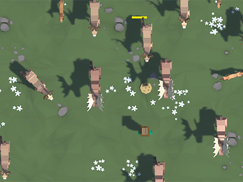

# Unity Learning

> In this repository, are the projects that I have done following the Unity Learning pathways and tutorials from the official Unity Learn website including some features that I have added to the projects to improve their performance and functionality. I have also added some of my own projects based on the Unity Learning tutorials.

## 🛠️ Build on
[](https://unity.com/download)
[](https://www.blender.org/download/)
[](https://docs.microsoft.com/en-us/dotnet/csharp/)

## Preview
### Prototaype 2
> How long could you be able to avoid the stampede and feed the animals to calm them out? </br> *Game scoreboard in the repo // Global scoreboard in the release!!


## 🚀 Getting Started

### 📋 Prerequisites

- Unity
  1. Download and install the [Unity Hub](https://unity.com/download).
  2. Choose your Unity version (2021.3.x) and install it.

- Git
  1. [Set up Git.](https://docs.github.com/en/get-started/quickstart/set-up-git)
  2. Don't forget to [set up authentication to GitHub.com from Git](https://docs.github.com/en/get-started/quickstart/set-up-git#next-steps-authenticating-with-github-from-git) as well.

### ⚙️ Setup

*Optional: If you want to use a copy of this repository, you can fork it to your own GitHub account.*

0. **SELECT A PROJECT**: You can select an specific project to clone by selecting the branch in the dropdown menu in the top left corner of the repository. If you want to clone all the projects, you can clone the `dev` branch.
1. Above the list of files, click ↓Code.
2. Using HTTPS, under "Clone with HTTPS", click the clipboard icon.
3. In the terminal, change the current working directory to the location where you want the cloned directory to be made.
4. Clone the repository to your local machine.
   ```sh
   git clone <HTTPS_URL>
   ```

### 💿 Install

1. Open the Unity Hub.
2. Click Add.
3. Select the project folder.
4. Click the project to open it.

### 🖱️ Usage

- Feel free to use or modify the projects as you wish.
- If you want to use the code or assets in your own projects, please give credit to the original authors.
- To run the project, click the play button in the Unity Editor.
- I highly recommend you to follow the tutorials from the official Unity Learn website to learn how to make the projects.
> *The files are organized in folders followning the Unity Learning Pathway and Tutorial that they are based on.* <br> *Some of the assets have been modified and could have different names from the original project name.*

### 📦 Deployment

1. To build the project, click File > Build Settings.
2. Select the platform you want to build for.
3. Click Build and Run.

## 👤 Author:

**J. Luis Arredondo *(Retky)***
- GitHub: [@Retky](https://github.com/Retky "J. Luis Arredondo GitHub")
- Twitter: [@RetkyFox](https://twitter.com/retkyFox "J. Luis Arredondo Twitter")
- LinkedIn: [Retky](https://www.linkedin.com/in/Retky "J. Luis Arredondo LinkedIn")

## 🤝 Contributing

Contributions, issues, and feature requests are welcome! Feel free to get in touch with any issues or suggestions.

- 🐛 **Bug reports & issues:** Use [GitHub Issues](https://github.com/Retky/UnityLearning/issues "Bugs & Issues")
- 💡 **Suggestions:** Use [Github Discussions](https://github.com/Retky/UnityLearning/discussions "Suggestions")
- 🙋‍♀️ **General questions:** Use [Github Discussions](https://github.com/Retky/UnityLearning/discussions "General Questions")

## ✨ Show your support

Give a ⭐️ if you like this project!

## 🙏 Acknowledgments

- Assets and tutorials from the [Unity Learn](https://learn.unity.com/ "Unity Learn") website.
- Assets from the [Unity Asset Store](https://assetstore.unity.com/ "Unity Asset Store") website.

## 📝 License

Copyright (c) 2022 J. Luis Arredondo

See [Licence](./LICENSE).
